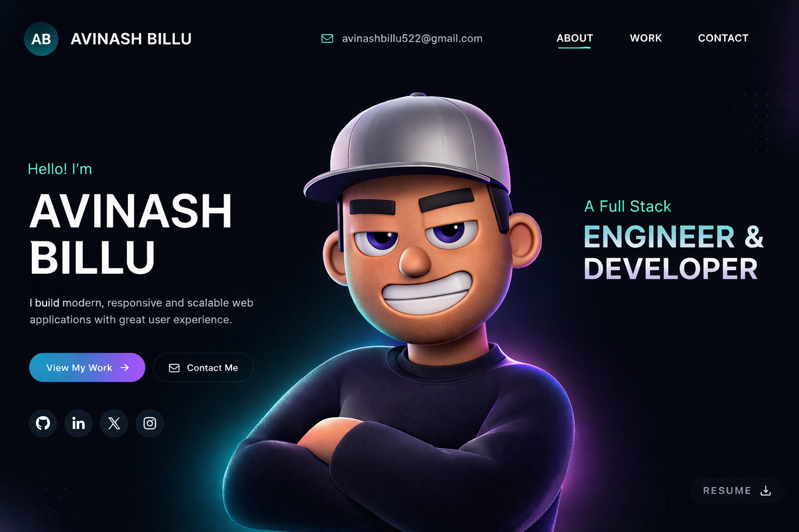

# Avinash Billu — Portfolio 🚀

This repository contains the open-source code for my personal portfolio website, designed and developed by Avinash Billu.
Explore the project and feel free to use it as inspiration.

## Instructions 🛠️

I have modified the gsap club plugins with the trial plugins, but with the trial plugin you cannot host it🔴. So for Club plugins, Check out here: https://gsap.com/docs/v3/Installation/

**Techstack** - React, TypeScript, GSAP, ThreeJS, WebGL, HTML, CSS, JavaScript

## License

This project is open source and available under the [MIT License](LICENSE).
